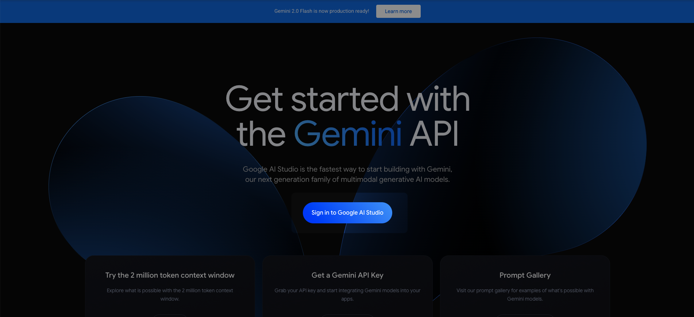
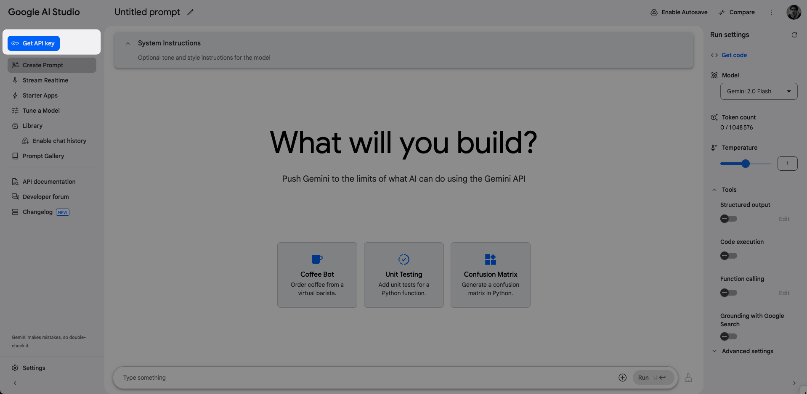
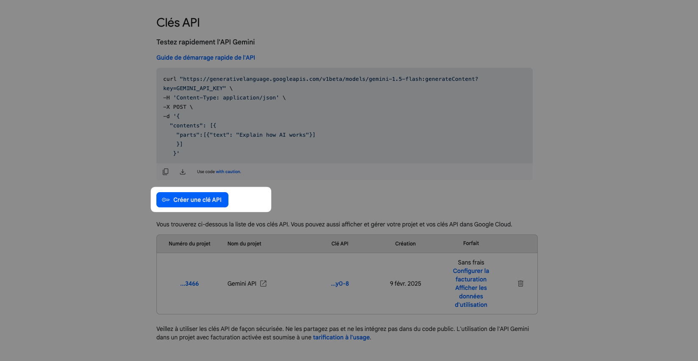
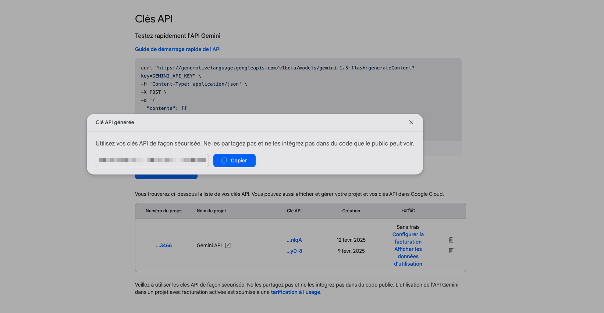

# Gemini Code Review

An AI boosted assistant that helps you review your code locally before asking for real "human" code review

## How to obtain an Google AI Studio API key

1. First go the [Google AI studio website](https://ai.google.dev/aistudio?hl=fr) and click the "Sign in to Google AI Studio" button.

2. Then click on the "Get API key" button 

3. Click on the "Create API key button" and select one of your Google Cloud Project to generate it (create one if you don't have any project yet).

4. The API key will then be generated. Now, all you have to do is copy and past this key inside the prompted extension field.

